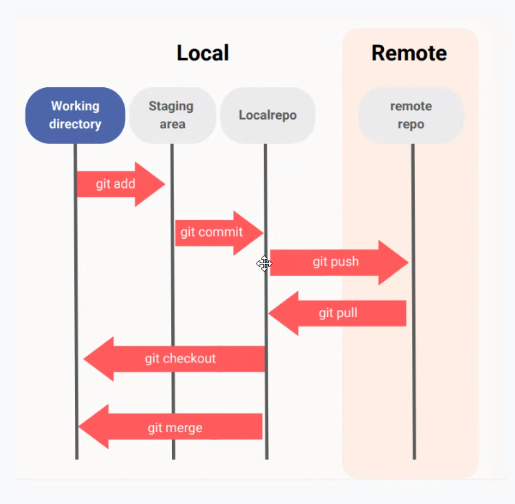

# [](https://git-scm.com)

- [Git - Book](https://git-scm.com//book/en/v2)
- [Git Extension Pack - Don Jayamanne](https://marketplace.visualstudio.com/items?itemName=donjayamanne.git-extension-pack)
- [Top Visual Studio Code Git Extensions in 2020](https://www.youtube.com/watch?v=N8L6RJ5uZoE)
- A distributed version control system, each user has the entire repository on their computer
- Helps you maintain a detailed history of the project as well as the ability to work on different versions of it.
- Lets you jump back to any point in the project to recover data or files.

- [](#)
  - [Configure Git](#configure-git)
  - [Usefull Overview](#usefull-overview)
  - [Create repositories](#create-repositories)
  - [Branches](#branches)
  - [Commit](#commit)
  - [Push](#push)
  - [Redo commits](#redo-commits)
  - [Tags](#tags)
  - [Connect to a remote repository](#connect-to-a-remote-repository)
  - [Update from remote repository](#update-from-remote-repository)
  - [Check out a repository](#check-out-a-repository)
  - [Undo local changes](#undo-local-changes)
  - [Make changes](#make-changes)
  - [Synchronize changes](#synchronize-changes)
  - [The .gitignore file](#the-gitignore-file)
  - [Create a new local repository](#create-a-new-local-repository)
  - [Branches](#branches-1)
  - [Add one or more files to staging](#add-one-or-more-files-to-staging)
  - [Commit](#commit-1)
  - [Push](#push-1)
  - [Tags](#tags-1)
  - [Connect to a remote repository](#connect-to-a-remote-repository-1)
  - [Update from remote repository](#update-from-remote-repository-1)
  - [Check out a repository](#check-out-a-repository-1)
  - [Undo local changes](#undo-local-changes-1)
  - [Commands](#commands)
  - [Terminology](#terminology)
  - [Commit Message Guidelines](#commit-message-guidelines)
  - [HOW TO'S](#how-tos)
  - [Tipps](#tipps)
  - [git help](#git-help)


## Configure Git

- Configure **user** name to be used with your commits.
  
  ```console
  git config --global user.email
  ```

- Configure the **email** address to be used with your commits.

  ```console
  git config --global user.email workingj@pm.me
  ```

- Set the **default Editor**

  ```console
  git config --global core.editor "code --wait"
  ```

- Enables helpful **colorization** of command line output

  ```console
  git config --global color.ui auto` 
  ```

- **Alias** `git checkout` to `git co`

  ```console
  git config --global alias.co checkout
  ```

### SSH

- SSH Key für Github.com generieren

    ```console
    ssh-keygen -t ed25519 -C "adress@server"
    ```

- Kopieren des SSH-Keys in den Zwischenspeicher und bei Github einfügen

    ```console
    clip < ~/.ssh/id_ed25519.pub
    ```

- SSH Zugang Testen & Fingerprint vergleichen:

    ```ssh -T git@github.com```

    SHA256:uNiVztksCsDhcc0u9e8BujQXVUpKZIDTMczCvj3tD2s (RSA)
    SHA256:br9IjFspm1vxR3iA35FWE+4VTyz1hYVLIE2t1/CeyWQ (DSA – veraltet)
    SHA256:p2QAMXNIC1TJYWeIOttrVc98/R1BUFWu3/LiyKgUfQM (ECDSA)
    SHA256:+DiY3wvvV6TuJJhbpZisF/zLDA0zPMSvHdkr4UvCOqU (Ed25519)

## Usefull Overview



## Create repositories

A new repository can either be created locally, or an existing repository can be cloned. When a repository was initialized locally, you have to push it to GitHub afterwards.

- ```$ git init``` The git init command turns an existing directory into a new Git repository inside the folder you are running this command. After using the git init command, link the local repository to an empty GitHub repository using the following command:

- ```$ git remote add origin [url]``` Specifies the remote repository for your local repository. The url points to a repository on GitHub.

- ```$ git clone [url]``` Clone (download) a repository that already exists on GitHub, including all of the files, branches, and commits

## Branches

Branches are an important part of working with Git. Any commits you make will be made on the branch you’re currently “checked out” to. Use `git status` to see which branch that is.

- ```$ git branch -M main``` rename master to main

- ```$ git branch [branch-name]``` Creates a new branch

- ```$ git switch -c [branch-name]``` Switches to the specified branch and updates the working directory

- ```$ git merge [branch]``` Combines the specified branch’s history into the current branch. This is usually done in pull requests, but is an important Git operation.

- ```$ git branch -d [branch-name]``` Deletes the specified branch

### Branches Workflow

1. ```$ git checkout -b <branchname>``` Create a new branch and switch to it:

2. ```$ git checkout <branchname>``` Switch from one branch to another:

3. ```$ git branch``` List all the branches in your repo, and tell you what branch you’re currently in:

4. ```$ git branch -d <branchname>``` Delete the feature branch:

5. ```$ git push --all origin``` Push all branches to your remote repository:

6. ```$ git push origin :<branchname>``` Push a branch into your remote repository:

7. ```$ git add <filename>``` or ```git add .``` Add one or more files to staging

## Commit

- `$ git commit -m "Commit message"` Commit changes to head:
- ``$ git commit -a -m "message"`` Commit any files you’ve added with git add, and also commit any files you’ve changed:

## Push

- ```$ git push origin master``` Send changes to the master branch of your remote repository

## Redo commits

Erase mistakes and craft replacement history

- ```$ git reset [commit]``` Undoes all commits after [commit], preserving changes locally

- ```$ git reset --hard [commit]``` Discards all history and changes back to the specified commit. CAUTION! Changing history can have nasty side effects

## Tags

1. `$ git tag 1.0.0 < commitID >` You can use tagging to mark a significant changeset, such as a release. CommitId is the leading characters of the changeset ID, up to 10, but must be unique.

2. `$ git log`  Get the ID using:

3. `$ git push --tags origin` Push all tags to remote repository:

## Connect to a remote repository

### If you haven’t connected your local repository to a remote server, add the server to be able to push to it

```console
git remote add origin < server >
```

### List all currently configured remote repositories

```console
git remote -v
```

## Update from remote repository

1. `$ git pull` Fetch and merge changes on the remote server to your working directory:

2. `$ git merge < branchname >` To merge a different branch into your active branch:

3. `$ git diff` View all the merge conflicts:

4. `$ git diff --base <filename>` View the conflicts against the base file:

5. `$ git diff < sourcebranch > < targetbranch >` Preview changes, before merging:

6. `$ git add <filename>` After you have manually resolved any conflicts, you mark the changed file

## Check out a repository

- `$ git clone /path/to/repository` Create a working copy of a local repository

- `$ git clone xx@host:/path/to/repository` For a remote server, use:

## Undo local changes

1. `$ git checkout -- <filename>` You can replace the changes in your working tree with:

2. `$ git fetch origin git reset --hard origin/master` To drop all your local changes and commits, fetch the latest history from the server and point your local master branch at it, do this:

---

- `git restore index.html` will undo all uncommitted local changes in the specified file. Please be careful because you cannot get these changes back once you've discarded them!

## Make changes

Browse and inspect the evolution of project files

- ```$ git log``` Lists version history for the current branch

- ```$ git log --follow [file]``` Lists version history for a file, beyond renames (works only for a single file)

- ```$ git diff [first-branch]...[second-branch]``` Shows content differences between two branches

- ```$ git show [commit]``` Outputs metadata and content changes of the specified commit

- ```$ git add [file]``` Snapshots the file in preparation for versioning

- ```$ git commit -m "[descriptive message]"``` Records file snapshots permanently in version history

## Synchronize changes

Synchronize your local repository with the remote repository on GitHub.com

- ```$ git fetch``` Downloads all history from the remote tracking branches

- ```$ git merge``` Combines remote tracking branches into current local branch

- ```$ git push``` Uploads all local branch commits to GitHub

- ```$ git pull``` Updates your current local working branch with all new commits from the corresponding remote branch on GitHub. git pull is a combination of git fetch and git merge

## The .gitignore file

Sometimes it may be a good idea to exclude files from being tracked with Git. This is typically done in a special file named `.gitignore`. You can find helpful templates for `.gitignore` files at [github.com/github/gitignore](https://github.com/github/gitignore).

## Create a new local repository

```console
git init
```

## Branches

### rename master to main

```console
git branch -M main
```

### 1. Create a new branch and switch to it

```console
git checkout -b < branchname >
```

### 2. Switch from one branch to another

```console
git checkout < branchname >
```

### 3. List all the branches in your repo, and tell you what branch you’re currently in

```console
git branch
```

### 4. Delete the feature branch

```console
git branch -d < branchname >
```

### 5. Push all branches to your remote repository

```console
git push --all origin
```

### 6. Push a branch into your remote repository

```console
git push origin :< branchname >
```

## Add one or more files to staging

```console
git add < filename > git add *
```

## Commit

### Commit changes to head

```console
git commit -m "Commit message"
```

### Commit any files you’ve added with git add, and also commit any files you’ve changed

```console
git commit -a -m "message"
```

## Push

### Send changes to the master branch of your remote repository

```console
git push origin master
```

## Tags

### 1. You can use tagging to mark a significant changeset, such as a release

```console
git tag 1.0.0 < commitID >
```

### 2. **CommitId** is the leading characters of the changeset ID, up to 10, but must be unique

### Get the ID using

```console
git log

git log --oneline
```

### 3. Push all tags to remote repository

```console
git push --tags origin
```

## Connect to a remote repository

### If you haven’t connected your local repository to a remote server, add the server to be able to push to it

```console
git remote add origin < server >
```

### List all currently configured remote repositories

```console
git remote -v
```

## Update from remote repository

### 1. Fetch and merge changes on the remote server to your working directory

```console
git pull
```

### 2. To merge a different branch into your active branch

```console
git merge < branchname >
```

### 3. View all the merge conflicts

```console
git diff
```

### 4. View the conflicts against the base file

```console
git diff --base < filename >
```

### 5. Preview changes, before merging

```console
git diff < sourcebranch > < targetbranch >
```

### 6. After you have manually resolved any conflicts, you mark the changed file

```console
git add < filename >
```

## Check out a repository

### Create a working copy of a local repository

```console
git clone /path/to/repository <dir_name>
```

### For a remote server, use

```console
git clone xx@host:/path/to/repository <dir_name>
```

## Undo local changes

### 1. You can replace the changes in your working tree with

```console
git checkout -- < filename >
```

### 2. To drop all your local changes and commits, fetch the latest history from the server and point your local master branch at it, do this

```console
git fetch origin git reset --hard origin/master
```

## Commands

### **[`git init`](https://git-scm.com/docs/git-init)**

[Git Basics - Getting a Git Repository](https://git-scm.com/book/en/v2/Git-Basics-Getting-a-Git-Repository#Initializing-a-Repository-in-an-Existing-Directory)

- Creates a repository and does all of the initial setup.
- The `.git` directory is the "repository" where git records all of the commits, configuration files and keeps track of everything! _Never directly edit any files inside the .git directory_

```console
git init
```

### **[`git clone`](https://git-scm.com/docs/git-clone)**

[Cloning an Existing Repository](https://git-scm.com/book/en/v2/Git-Basics-Getting-a-Git-Repository#_git_cloning)

- takes the path to an existing repository
- by default will create a directory with the same name as the repository that's being cloned
- can be given a second argument that will be used as the name of the directory
- will create the new repository inside of the current working directory
- has a number of different transfer protocols you can use. `https://`, `git://`, ssh...

```console
git clone <path-to-repository>
git clone <path-to-repository> <new-folder name>
```

### **[`git status`](https://git-scm.com/docs/git-status)**

[Recording Changes to the Repository](https://git-scm.com/book/en/v2/Git-Basics-Recording-Changes-to-the-Repository#Checking-the-Status-of-Your-Files)

- will display information depending on the state of your files, the working directory, and the repository
- You should always run the git status command. Especially when returning to a project after a period of time.

```console
git status
```

### **[`git log`](https://git-scm.com/docs/git-log)**

[Viewing the Commit History](https://git-scm.com/book/en/v2/Git-Basics-Viewing-the-Commit-History)

- Show logs for all existing commits
- displays by default: SHA, author, date, commit message
- **Navigating** The Log:  `one line | half the page | whole page`
  - scroll **down: `↓ o. j, d, f`**
  - scroll **up: `↑ o. k, u, b`**
  - **quit: `q`**

```console
$ git log # Zeige das ganze Log
$ git log <sha> # Zeige nur Commit mit passendem sha
$ git log --grep <text> # Suche nach Commits mit beinhaltetem text
$ git log --author # Zeige nur commits von diesem Author
$ git log --oneline # In nur einer Zeile
$ git log --stat # Zeigt wieviel und welche Dateien wie oft verändert wurden
$ git log -p|--patch # displays the files and the location of the lines that
                     # have been modified and the actual changes that have been made
$ git log --stat -p #  Display the stats info above the patch info
$ git log -p -w # Ignores all whitespace changes
```

### **[`git show`](https://git-scm.com/docs/git-show)**

- Displays only Info about the given commit
- [Generating patch text with -p](https://git-scm.com/docs/git-diff#_generating_patch_text_with_p)

```console
$ git show
$ git show <sha> # Jump to commit with given sha
$ git show --stat# Zeigt wieviel und welche Dateien wie oft verändert wurden
$ git show -p|--patch # displays the files and the location of the lines that
                      # have been modified and the actual changes that have been made
$ git show --stat -p # Display the stats info above the patch info
$ git show -w # Ignores all whitespace changes
```

### **[`$ git diff`](https://git-scm.com/docs/git-diff)**

- Show changes that have been made, changes between commits, commit and working tree, etc

```console
git diff
```

### **[`git add`](https://git-scm.com/docs/git-add)**

- to move files from the Working Directory to the Staging Index (staging)

```bash
git add <file>
git add <folder/file> <folder/file>`
git add . # Add all files and nested files
```

### **[`git rm`](https://git-scm.com/docs/git-rm)**

- removes files from the Staging Index. (unstage)

```console
git rm --cached <file>
```

### **[`git commit`](https://git-scm.com/docs/git-commit)**

- Record changes to the repository
- **each commit should have a single focus.**
- a commit message must be supplied, lines that start with a `#` are comments and will not be recorded
- **keep the message short, explain what the commit does**

```console
git commit # opens the default editor
git commit -m "Initial commit" # bypass editor
```

### **[`git config`](https://git-scm.com/docs/git-config)**

[Customizing Git - Git Configuration](https://git-scm.com/book/en/v2/Customizing-Git-Git-Configuration)

```console
git config --list  `
```

## Terminology

### Branch

A branch is when a new line of development is created that diverges from the main line of development. This alternative line of development can continue without altering the main line.
Going back to the example of save point in a game, you can think of a branch as where you make a save point in your game and then decide to try out a risky move in the game. If the risky move doesn't pan out, then you can just go back to the save point. The key thing that makes branches incredibly powerful is that you can make save points on one branch, and then switch to a different branch and make save points there, too.

### Checkout

A checkout is when content in the repository has been copied to the Working Directory.
Staging Area / Staging Index / Index
A file in the Git directory that stores information about what will go into your next commit. You can think of the staging area as a prep table where Git will take the next commit. Files on the Staging Index are poised to be added to the repository.

### Commit

Git thinks of its data like a set of snapshots of a mini filesystem. Every time you commit (save the state of your project in Git), it basically takes a picture of what all your files look like at that moment and stores a reference to that snapshot. You can think of it as a save point in a game - it saves your project's files and any information about them.

### Repository / repo

A Git repository is a virtual storage of your project. It allows you to save versions of your code, which you can access when needed.
A repository is a directory which contains your project work, as well as a few files (hidden by default on Mac OS X) which are used to communicate with Git. Repositories can exist either locally on your computer or as a remote copy on another computer. A repository is made up of commits.

### SHA

A SHA isan ID number for each commit. It is a 40-character string composed of characters (0–9 and a–f) and calculated based on the contents of a file or directory structure in Git.

### Staging Index

### VCS / SCM

Version Control System / Source Code Manager

### Working Directory

The Working Directory is the files that you see in your computer's file system. When you open your project files up on a code editor, you're working with files in the Working Directory.
This is in contrast to the files that have been saved (in commits!) in the repository.
When working with Git, the Working Directory is also different from the command line's concept of the current working directory which is the directory that your shell is "looking at" right now.

## Commit Message Guidelines

[Udacity Git Commit Message Style Guide](https://udacity.github.io/git-styleguide/)

### Good Commit Messages

- **Do**
  
  - do keep the message short (less than 60-ish characters)
  - do explain what the commit does (not how or why!)

- **Do not**
  
  - do not explain why the changes are made (more on this below)
  - do not explain how the changes are made (that's what git log -p is for!)
  - do not use the word "and" if you have to use "and", your commit message is probably doing too many changes - break the changes into separate commits e.g. "make the background color pink and increase the size of the sidebar"

The best way thatis to come up with a commit message is to finish this phrase, "This commit will...". However, you finish that phrase, use that as your commit message.

**Above all, be consistent in how you write your commit messages!**

### Explain the Why

When you're writing the commit message, the first line is the message itself. After the message, leave a blank line, and then type out the body or explanation including details about why the commit is needed
This details section of a commit message is included in the `git log`

## HOW TO'S

### how to create a pull request on a public repo

1. fork the repo on the website

2. git clone your fork to your machine

3. create a new branch on your local clone

   ```console
   git checkout -b name-of-the-branch
   ```

4. do your edits

   1. to see your changes

      ```console
      git status
      ```

      ```console
      git diff
      ```

5. add your files to the staging index

   ```console
   git add <file>
   ```

6. commit your changes to the repository

   ```console
   git commit -m "your message"
   ```

7. Push the repository to the GitHub

   ```console
   git push origin 'branch-name'
   ```

   or:

   ```console
   git pull-request (?)
   ```

8. on the github website create the Pull request

## Tipps

- Nicht zu viel Zeit lassen bis zum Pull request damit sich nciht zu viele changes aufstauen
- Immer wieder Locales mergen von remotechanges in main oder eigene branches um mit aktueller Version zu arbeiten
- mit Team absprechen das es pullrequests gab auf main und jeder seinen working branches updated

```console
git log

git log --oneline

git restore index.html
```

## git help

https://www.datacamp.com/community/tutorials/git-push-pull

https://www.youtube.com/watch?v=rgbCcBNZcdQ

https://swcarpentry.github.io/git-novice/
